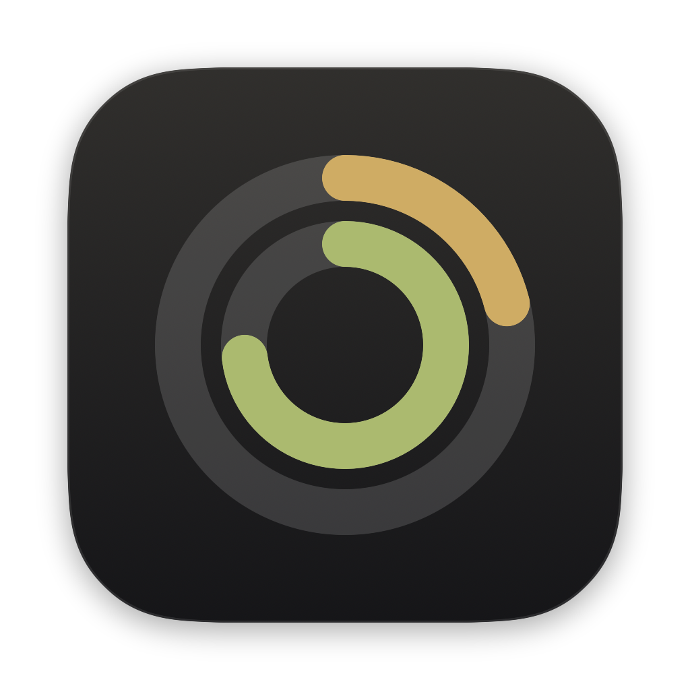
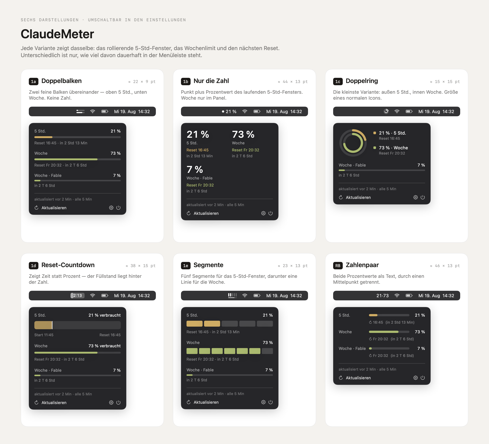
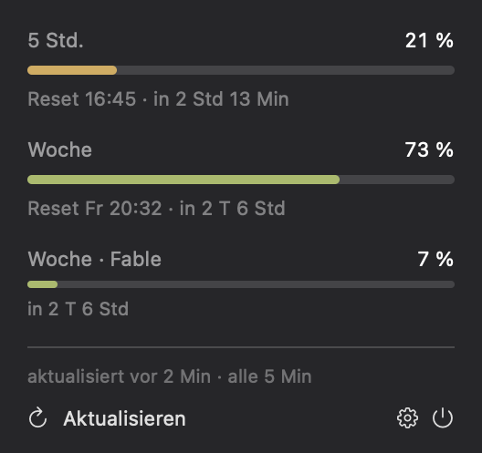
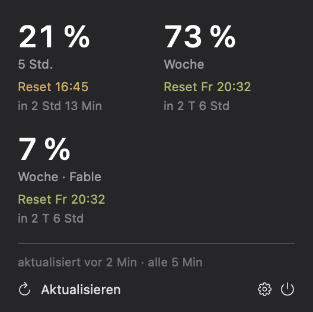
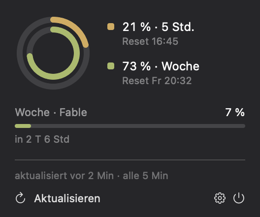
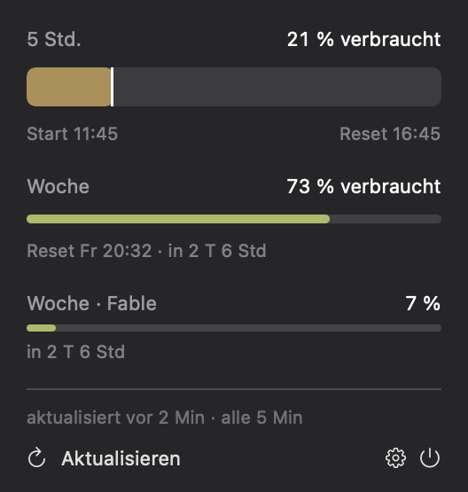
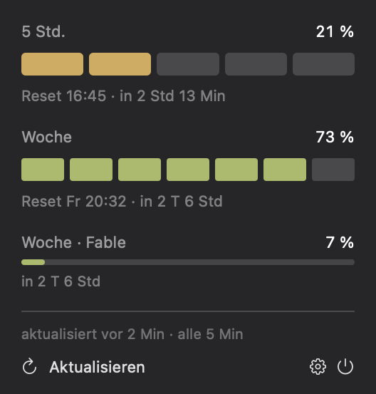
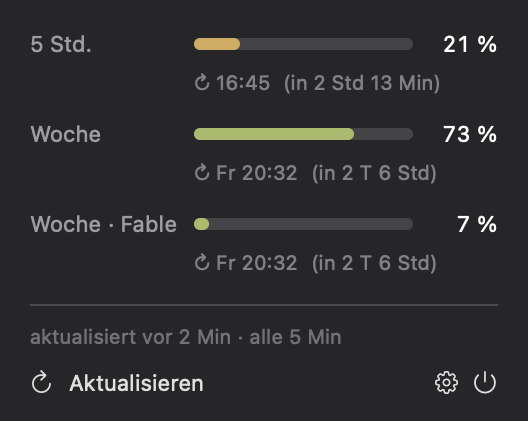

<div align="center">



# ClaudeMeter — Claude Usage in Your macOS Menu Bar

**A tiny, native macOS menu bar app that shows how much of your Claude subscription you have used — the rolling 5-hour session limit, the weekly limit, and exactly when each one resets.**

[](#requirements)
[](#build-from-source)
[](#how-it-works)
[](#why-no-dependencies)
[](#requirements)
[](#tests)
[](LICENSE)

🇩🇪 **[Deutsche Version dieser Seite →](README.de.md)**

</div>

---

## What is ClaudeMeter?

If you use **Claude Code** or a **Claude Pro / Max subscription** heavily, you have probably been
surprised by a rate limit mid-task. Claude enforces two limits at once — a **rolling 5-hour session
window** and a **weekly quota** (plus a model-scoped weekly limit on Max plans) — and neither is
visible while you work.

ClaudeMeter puts all of them in your menu bar. It refreshes every 5 minutes, takes ~1 MB, has **zero
dependencies**, and never writes to your Claude Code credentials.

> **Keywords:** Claude usage monitor · Claude Code usage tracker · Claude rate limit macOS ·
> Claude quota menu bar · Anthropic usage dashboard · Claude Max weekly limit · Claude 5-hour limit ·
> SwiftUI MenuBarExtra · macOS menu bar app



---

## Table of contents

- [Features](#features)
- [Six built-in designs — switch any time](#six-built-in-designs--switch-any-time)
- [Install](#install)
- [Settings](#settings)
- [How it works](#how-it-works)
- [Troubleshooting](#troubleshooting)
- [Build from source](#build-from-source)
- [FAQ](#faq)
- [Known limitations](#known-limitations)
- [Project layout](#project-layout)

---

## Features

| | |
|---|---|
| 📊 **All limits at a glance** | Rolling 5-hour session window, weekly quota, and model-scoped weekly limits on Max plans |
| ⏱ **Reset times, not guesses** | Every window shows a local wall-clock reset time *and* a countdown (`16:45 · in 2 Std 13 Min`) |
| 🎨 **Six switchable designs** | From a 15 × 15 pt double ring to a full percentage pair — change it in settings, no rebuild |
| 🪶 **Genuinely small** | ~1 MB binary, no Node, no Python, no Electron, no third-party Swift packages |
| 🌓 **Native menu bar behaviour** | Template rendering follows light mode, dark mode and tinted menu bars automatically |
| 🔒 **Read-only credentials** | Never refreshes, rotates or writes your Claude Code login — it cannot break your CLI |
| 🔋 **Sleep-aware** | Zero network traffic while the Mac sleeps; instant refresh on wake |
| ⚠️ **Fails loudly, not silently** | On error the last known value stays visible but is marked stale with its age |
| 🚫 **No Dock icon** | `LSUIElement` — menu bar only, no window, no app switcher entry |
| 🩺 **Built-in doctor** | `swift run claudemeter-doctor` verifies the whole chain and prints what it found |

---

## Six built-in designs — switch any time

The user request that shaped this app: *all* the design concepts were good, so **all of them
shipped**. Pick one in settings; it changes both the menu bar glyph and the click panel.

| | Design | Menu bar footprint | What sits in the menu bar |
|---|---|---|---|
| **1a** | **Doppelbalken** (Dual bar) | ≈ 22 × 9 pt | Two hairline bars — session on top, week below. No number. |
| **1b** | **Nur die Zahl** (Number only) | ≈ 44 × 13 pt | A dot plus the session percentage. Week lives in the panel. |
| **1c** | **Doppelring** (Dual ring) — *default* | ≈ 15 × 15 pt | Concentric rings, the size of a normal menu bar icon. |
| **1d** | **Reset-Countdown** | ≈ 38 × 15 pt | Time until reset, with the fill level behind the number. |
| **1e** | **Segmente** (Segments) | ≈ 23 × 13 pt | Five pips for the session, a hairline for the week. |
| **RB** | **Zahlenpaar** (Number pair) | ≈ 46 × 13 pt | Both percentages as text, `21·73`. |

<details>
<summary><b>See each design on its own</b> (menu bar + panel)</summary>

### 1a · Doppelbalken



### 1b · Nur die Zahl



### 1c · Doppelring *(default)*



### 1d · Reset-Countdown



### 1e · Segmente



### RB · Zahlenpaar



</details>

> Every screenshot above is rendered directly from the shipping SwiftUI views by
> `swift run AssetGen` — so the documentation cannot drift away from the real app.

---

## Install

### Requirements

- macOS **13 Ventura** or newer (Apple Silicon or Intel)
- **Claude Code** installed and logged in with a Pro or Max subscription
- Xcode command line tools (only to build — `xcode-select --install`)

### Build and install

```bash
git clone https://github.com/koljasagorski/Claude-Quota.git
cd Claude-Quota
./scripts/bundle.sh
cp -R build/ClaudeMeter.app /Applications/
open /Applications/ClaudeMeter.app
```

That is the whole installation. No package manager, no runtime, no configuration file.

### First launch: the keychain prompt

ClaudeMeter reads Claude Code's OAuth token from your keychain, so macOS asks once:

> *"ClaudeMeter wants to access key 'Claude Code-credentials' in your keychain."*

Choose **Always Allow**. This is expected and documented — the app only ever *reads*.

<details>
<summary><b>Stop the prompt reappearing after every rebuild</b> (recommended for daily use)</summary>

An ad-hoc signature (`codesign --sign -`) changes on every build, so macOS treats each build as a
different app and asks again. Create a stable self-signed identity once:

1. Open **Keychain Access** → menu **Keychain Access › Certificate Assistant › Create a Certificate…**
2. Name: `ClaudeMeter Dev` · Identity Type: **Self Signed Root** · Certificate Type: **Code Signing**
3. Then build with that identity:

```bash
SIGN_IDENTITY="ClaudeMeter Dev" ./scripts/bundle.sh
```

The prompt now appears exactly once, ever.

</details>

### Launch at login

Toggle **"Beim Anmelden starten"** in settings. It uses `SMAppService` (macOS 13+) — no hand-written
LaunchAgent plist. The app must live in `/Applications` for macOS to accept the registration.

---

## Settings

Click the menu bar item, then the ⚙️ button.

| Setting | Default | What it does |
|---|---|---|
| **Darstellung** (Design) | Doppelring | Switches between all six designs, with a live preview of each |
| **Farbe in der Menüleiste** (Colour in menu bar) | off | Off renders a template image that follows light/dark mode and tinted menu bars. On uses the design's amber/green accents. |
| **Alle Limit-Fenster zeigen** (Show all windows) | on | Shows model-scoped weekly limits (Max plans) in addition to the main two |
| **Beim Anmelden starten** (Launch at login) | off | Registers the app via `SMAppService` |

---

## How it works

```
Keychain / env / file  ──▶  TokenProvider  ──▶  UsageClient  ──▶  UsageParser  ──▶  UsageStore  ──▶  SwiftUI
   (read-only)                                GET /api/oauth/usage      normalise        state + polling
```

ClaudeMeter calls the same undocumented endpoint Claude Code itself uses:

```http
GET https://api.anthropic.com/api/oauth/usage
Authorization: Bearer <token from your keychain>
anthropic-beta: oauth-2025-04-20
User-Agent: claude-code/<detected version>
```

Full findings from verifying this against a live account — including the exact response schema,
the percentage-scale question, and two keychain traps — are documented in
**[`docs/DATA-SOURCE.md`](docs/DATA-SOURCE.md)**, with a real (secret-free) response in
[`docs/usage-schema-sample.json`](docs/usage-schema-sample.json).

### Polling and rate limits

| Trigger | Behaviour |
|---|---|
| Timer | Every **5 minutes**, with 30 s tolerance so macOS can coalesce wake-ups |
| Panel opened | Immediate refresh, but at most once per 60 s (click-spam must not cause a 429) |
| Wake from sleep | Immediate refresh — values after sleep are guaranteed stale |
| Asleep | **No requests at all** |
| HTTP 429 | Backoff ladder **5 → 10 → 20 → 30 minutes** |
| HTTP 401 | Re-resolve the token, exactly **one** retry, then a visible error |

Exactly one request is ever in flight; concurrent triggers are dropped rather than queued.
Over 30 minutes of normal operation that is **6 requests**.

### Why no dependencies?

`Foundation`, `SwiftUI`, `Security`, `ServiceManagement` and `AppKit` cover everything. No Alamofire,
no KeychainAccess, no Sparkle. The result is a ~1 MB binary that builds headlessly with
`swift build` — no Xcode project file in the repository.

### Your credentials are safe

- ClaudeMeter **never** writes to the keychain, **never** refreshes a token, **never** rotates a
  refresh token. Triggering a refresh would invalidate Claude Code's own login.
- An expired token produces a clear message ("start Claude Code once"), not a refresh attempt.
- The token is re-read on every poll and never cached, logged, or written to `UserDefaults`.
- No telemetry, no analytics, no network traffic other than the single usage request.

---

## Troubleshooting

Run the built-in doctor. It walks the exact path the app takes and reports each stage:

```bash
swift run claudemeter-doctor
```

```
ClaudeMeter Doctor
────────────────────────────────────────────────────

1. Anmeldung
✓ Quelle: Schlüsselbund (Claude Code-credentials)
· Abo: max · Tarif: default_claude_max_5x
· Token läuft in 207 Min ab
· Token-Länge: 108 Zeichen (Wert wird nicht ausgegeben)

2. Abfrage
· GET https://api.anthropic.com/api/oauth/usage
· anthropic-beta: oauth-2025-04-20
· User-Agent: claude-code/2.1.235
✓ HTTP 200, 3 Limit-Fenster erkannt

3. Normalisierte Fenster
   5 Std.           ██████░░░░░░░░░░░░░░  33 %  ↻ 13:20 (in 3 Std 38 Min)
   Woche            ███████████████░░░░░  76 %  ↻ Fr 20:00 (in 2 T 10 Std)
   Woche · Fable    █░░░░░░░░░░░░░░░░░░░   7 %  ↻ Fr 20:00 (in 2 T 10 Std)

Alles in Ordnung.
```

The doctor never prints your token.

| Symptom | Cause | Fix |
|---|---|---|
| *"Keine Anmeldung gefunden"* | No Claude Code login on this Mac | Run `claude` once and sign in |
| *"Token abgelaufen"* | Access token past `expiresAt` | Start Claude Code once; it refreshes on its own |
| *"Nicht autorisiert (401)"* | Token rejected | Sign in to Claude Code again |
| *"Zu viele Anfragen (429)"* | Rate limited | Nothing to do — backoff handles it |
| *"Dieses Konto hat keine Abo-Limits"* | API/console account, not a subscription | Expected; there is no usage data to show |
| Menu bar item missing | Menu bar full (notch Macs) | Hide another item, or pick the 15 × 15 pt Doppelring design |

---

## Build from source

```bash
swift build -c release      # warning-free
swift test                  # 49 tests
./scripts/bundle.sh         # → build/ClaudeMeter.app, code-signed
swift run claudemeter-doctor  # verify the live data path
swift run AssetGen          # regenerate README screenshots + AppIcon.icns
```

### Tests

49 tests, no network required. They cover the things that actually broke during development:

- Both response schemas, and the hybrid the API really returns
- Codename placeholders (`nimbus_quill`, `tangelo`, …) never becoming fake 0 % rows
- `0.8` meaning 0.8 %, never 80 %
- UTC `resets_at` rendering as local wall-clock time
- MCP keychain entries never being mistaken for the subscription credential
- The menu bar label being the same width for every value from 0 to 100
- Malformed, hostile and truncated payloads not crashing anything

---

## FAQ

<details>
<summary><b>Does this work without Claude Code installed?</b></summary>

Not out of the box — ClaudeMeter reads the OAuth token Claude Code stores in your keychain. You can
supply your own token via the `CLAUDEMETER_TOKEN` environment variable or a keychain entry named
`de.sagorski.claudemeter.token`, but you need to obtain one yourself.
</details>

<details>
<summary><b>Is it safe? Could it break my Claude Code login?</b></summary>

No. ClaudeMeter only ever *reads* the credential. It never calls a refresh endpoint, never writes to
the keychain, and never rotates the refresh token — the one operation that could break Claude Code.
</details>

<details>
<summary><b>Why does it say 5 hours when I read about a 4-hour limit?</b></summary>

The short window is a **rolling 5-hour** window. The 4-hour figure circulates widely but is wrong.
</details>

<details>
<summary><b>Is the API official?</b></summary>

**No.** `/api/oauth/usage` is undocumented and internal to Claude Code. It has already changed shape
once. ClaudeMeter parses defensively and shows a visible error rather than stale numbers if it
breaks. See [Known limitations](#known-limitations).
</details>

<details>
<summary><b>Does it work on Claude Pro, or only Max?</b></summary>

Both. Pro accounts have one weekly window, Max accounts have two (plus a model-scoped one). The
panel renders 2–4 rows depending on what your account reports — nothing is hard-coded.
</details>

<details>
<summary><b>How much battery / network does it use?</b></summary>

One HTTPS request every 5 minutes while awake, none while asleep. The timer carries a 30 s tolerance
so macOS can batch wake-ups.
</details>

<details>
<summary><b>Can I change the refresh interval?</b></summary>

Not from the UI, by design — the endpoint is aggressively rate limited and a shorter interval
invites 429s. Change `UsageStore.baseInterval` if you build from source; it is floored at 60 s.
</details>

<details>
<summary><b>Does it show token counts or cost in dollars?</b></summary>

No. The endpoint reports percentage utilisation per limit window, not token counts. Spend fields
exist in the response but are only populated for accounts with extra usage credits enabled.
</details>

---

## Known limitations

Read this before relying on ClaudeMeter:

- **The data source is unofficial.** `/api/oauth/usage` is undocumented, used internally by Claude
  Code, and Anthropic can change or remove it without notice.
- **The `anthropic-beta` header carries a date.** If Anthropic retires `oauth-2025-04-20`, requests
  start failing. The app surfaces that as a visible error rather than silently showing old numbers.
- **The endpoint is rate limited.** Never poll faster than 60 s. The default is 5 minutes.
- **Percentages come from the API as-is.** ClaudeMeter does not compute usage itself and cannot be
  more accurate than the endpoint.
- **The 7-block weekly view in the Segmente design is not per-day history.** It divides the single
  weekly figure into blocks. Real daily history would need local storage (planned, see below).
- **App Sandbox is not enabled**, because reading another app's keychain item and `~/.claude`
  requires access the sandbox denies.

### Roadmap

- Notification at 80 % / 95 % per window, once per window rather than per tick
- 24-hour usage history sparkline in the panel
- Optional English UI (the interface is currently German)

---

## Project layout

```
Claude-Quota/
├─ Package.swift                     # swift-tools-version 5.9, macOS 13+, zero dependencies
├─ Sources/
│  ├─ ClaudeMeter/                   # @main shell — MenuBarExtra only
│  ├─ ClaudeMeterKit/                # all logic, unit-testable
│  │  ├─ TokenProvider.swift         # read-only credential resolution (4 sources)
│  │  ├─ UsageClient.swift           # the HTTP call, retry and status mapping
│  │  ├─ UsageParser.swift           # tolerant parser for both response schemas
│  │  ├─ UsageStore.swift            # polling, backoff, sleep/wake
│  │  ├─ Models.swift                # LimitWindow, UsageSnapshot, FetchError
│  │  ├─ AppSettings.swift           # the six designs + preferences
│  │  ├─ Formatting.swift            # local-time and duration strings
│  │  ├─ Theme.swift                 # design tokens
│  │  └─ Views/                      # glyphs, six panel layouts, settings
│  ├─ Doctor/                        # claudemeter-doctor troubleshooting CLI
│  └─ AssetGen/                      # renders README screenshots + app icon
├─ Tests/ClaudeMeterKitTests/        # 49 tests incl. real API fixtures
├─ Resources/Info.plist              # LSUIElement = true
├─ scripts/bundle.sh                 # binary → signed .app
├─ docs/DATA-SOURCE.md               # verified endpoint findings
└─ assets/                           # generated screenshots
```

---

## Background documents

- [`docs/runbook.md`](docs/runbook.md) — the original build specification this app was written from
- [`docs/design-brief.md`](docs/design-brief.md) — pointer to the Claude Design project the six designs come from
- [`docs/DATA-SOURCE.md`](docs/DATA-SOURCE.md) — verified findings about the usage endpoint
- [`CHANGELOG.md`](CHANGELOG.md) — release history

---

## Contributing

Issues and pull requests are welcome. If you hit a response shape ClaudeMeter parses badly, please
attach the output of `swift run claudemeter-doctor` (it never prints your token) and, if you can, a
redacted response body.

## License

[MIT](LICENSE) © Kolja Sagorski

---

<div align="center">

**Built for people who would rather see the limit coming than hit it.**

If ClaudeMeter is useful to you, a ⭐ helps others find it.

</div>
